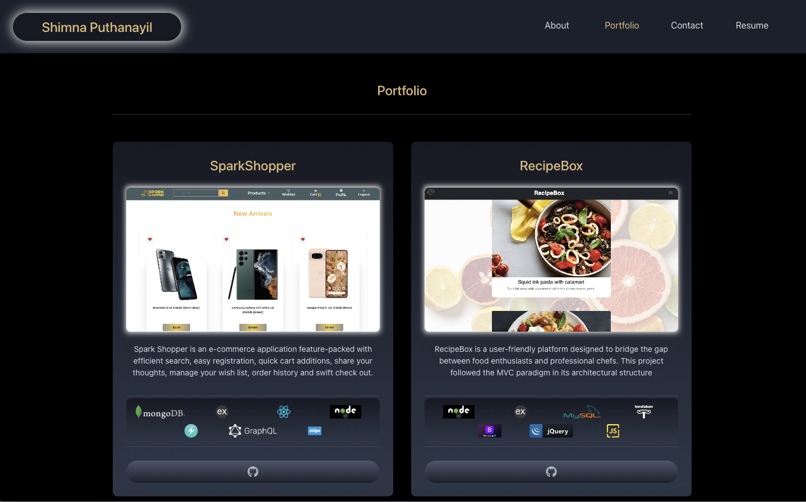

# Portfolio

## Description

This application is a single-page application portfolio for web developers built using React. The project helps developers to create a captivating showcase for their work. The application comprises of 4 sections About Me, Portfolio, Contact and Resume. The About Me section contains a photo and a short bio about the developer. The Portfolio section showcases titled images of six of the developer’s applications with links to both the deployed applications and the corresponding GitHub repository. The contact section contains a contact form which includes fields for name, email address and message. The Resume section comprises of a link to a downloadable resume and a list of the developer’s proficiencies. The footer displays the icon links to the developer’s GitHub and LinkedIn profiles, and their profile on a third platform (Stack Overflow, Twitter). The app is responsive and designed using Chakra UI component library.

## Installation

- Install Node.js v16
- Clone the Repository from GitHub and navigate to the root directory
- Install necessary dependencies running the following command :

  ```
  npm i
  ```

## Usage

The user is presented with the 'About Me' section which includes the photo and short description of the developer, when the application is opened. When the user clicks on the navigation links, corresponding sections will be displayed. The 'Portfolio' section contains the title ,image, a short description and icon link to the GitHub repository of the applications. The image will be highlighted on mouse hover and when the title or image of the project is clicked, the user will be redirected to the deployed application. In the 'Contact Me' section the fields name, email address and message are validated .In the Resume section the resume can be downloaded by clicking on the link and also the front end and back end skills are displayed side by side.

#### Deployed application can be found here :

https://dapper-empanada-1db9b0.netlify.app/

The application can be invoked in the terminal by using the following command:

```
npm start
```

The following images show the web application's appearance and functionality :

**About Me**


**Portfolio**



**Contact Me**


**Resume**


## Technologies Used

- **React JS**

- **Chakra UI**

- **Formik**

- **Vite**

- **Node JS**

- **JavaScript**

## Credits

#### References

https://chakra-ui.com/docs/components/form-control/usage

https://formik.org/

https://dev.to/shriram27/fixed-navbar-using-chakra-ui-4i7b

https://chakra-ui.com/getting-started/with-formik

https://chakra-templates.dev/components/cards

https://react-icons.github.io/react-icons/icons?name=fa

https://stackoverflow.com/questions/2781549/removing-input-background-colour-for-chrome-autocomplete

https://stackoverflow.com/questions/70041472/chakra-ui-for-react-change-focus-bordercolor-not-work

https://www.geeksforgeeks.org/how-to-trigger-a-file-download-when-clicking-an-html-button-or-javascript/
